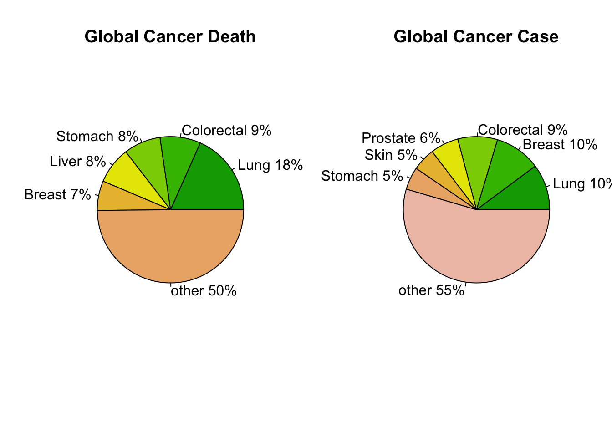
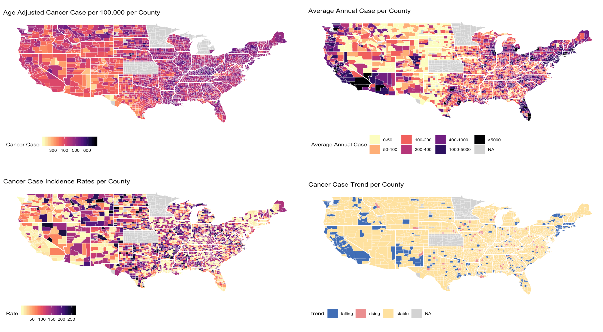
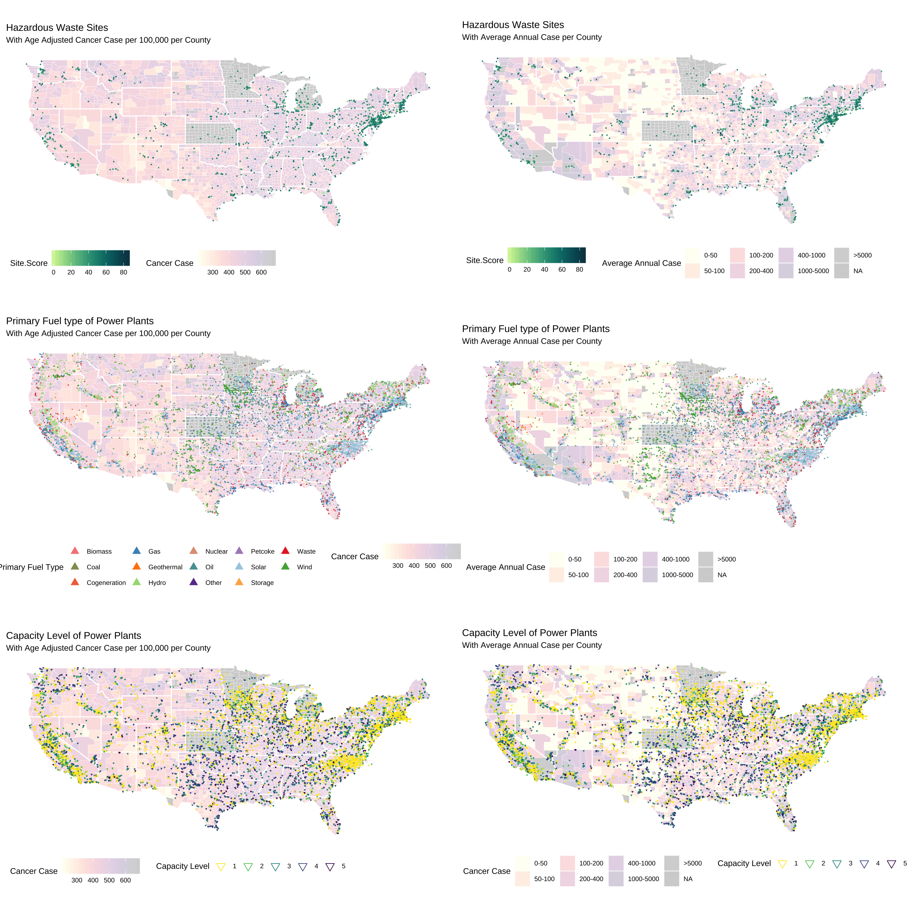
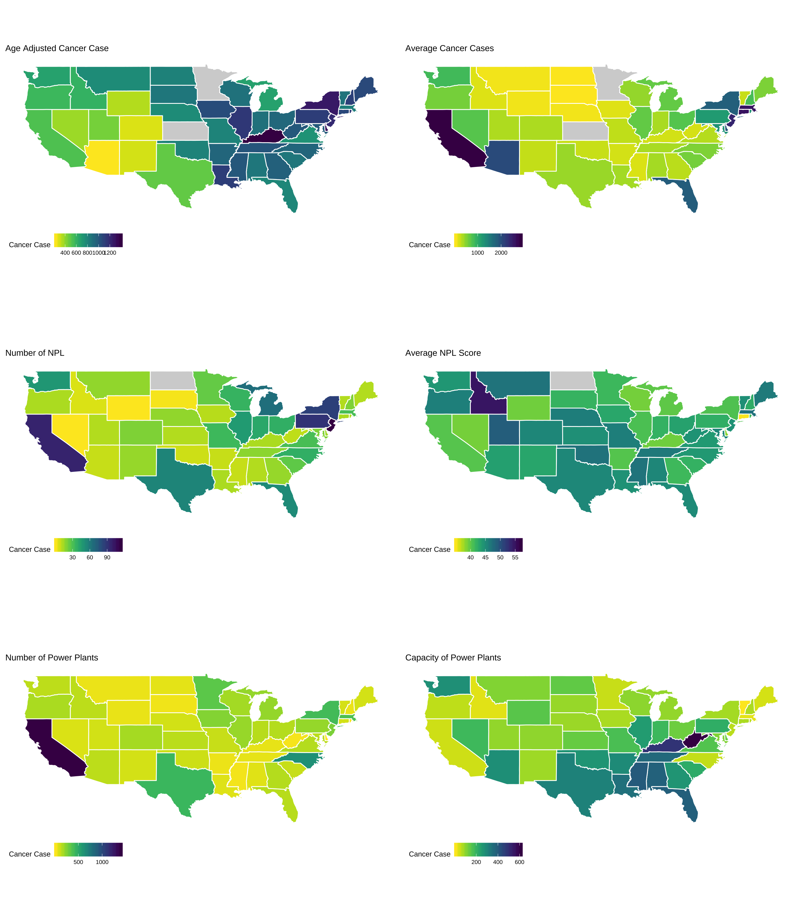
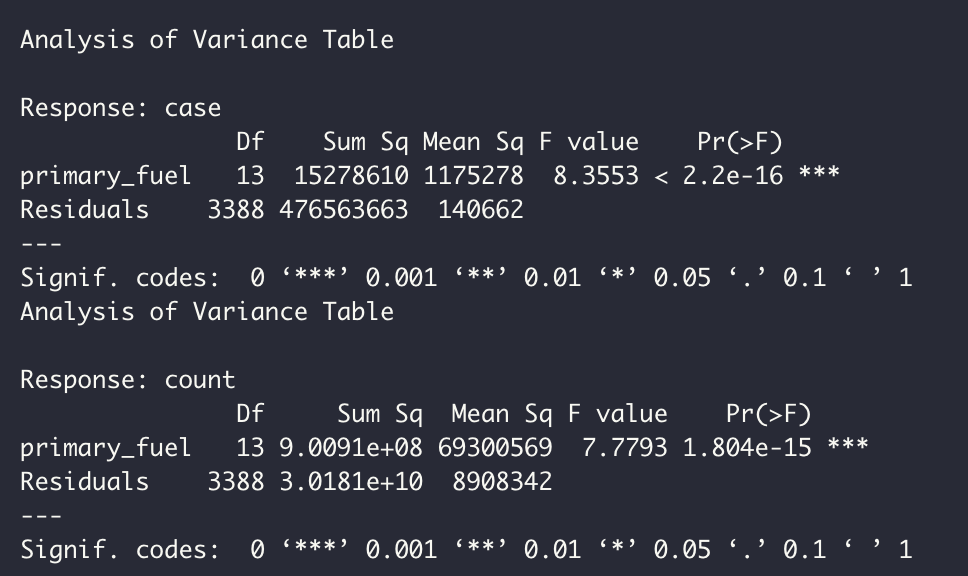
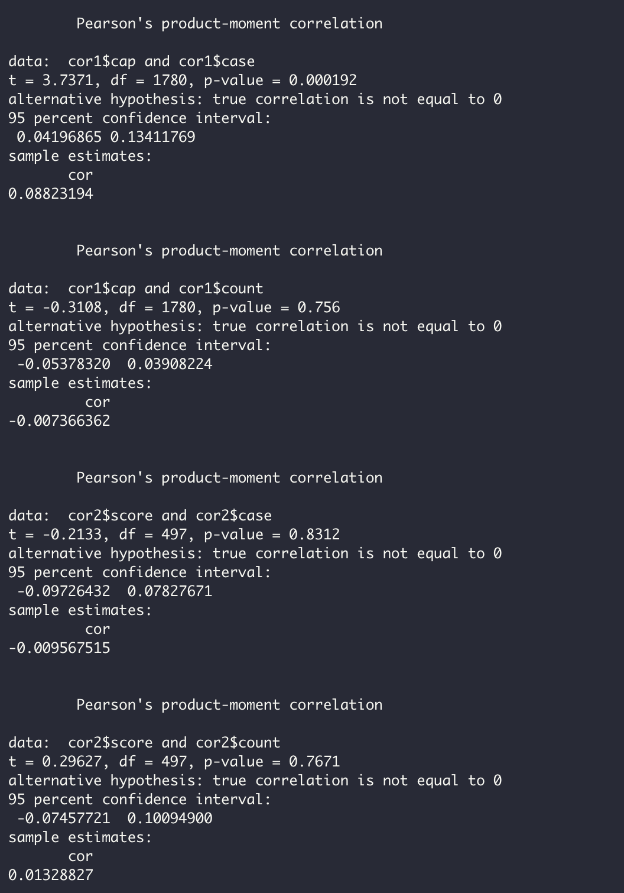
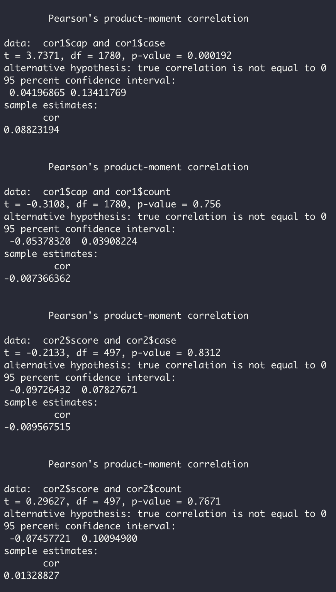
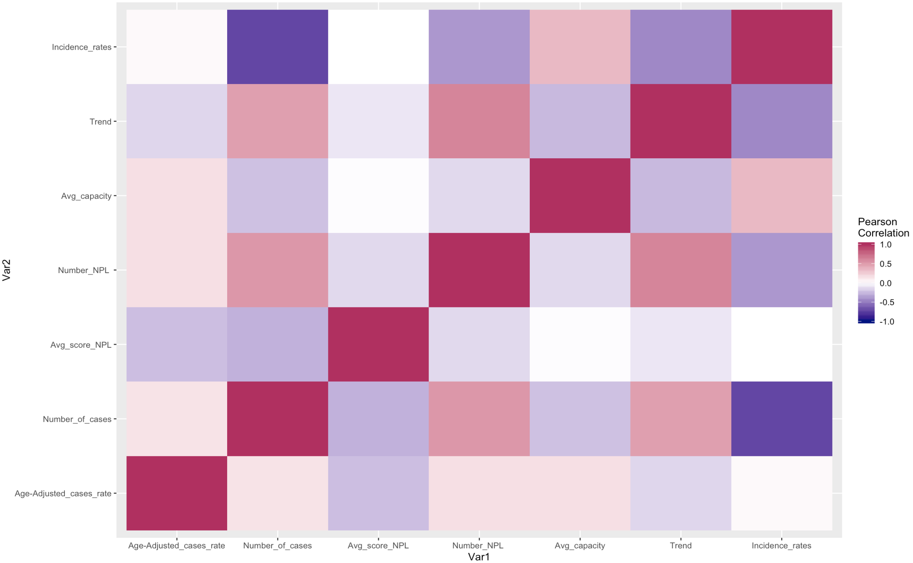
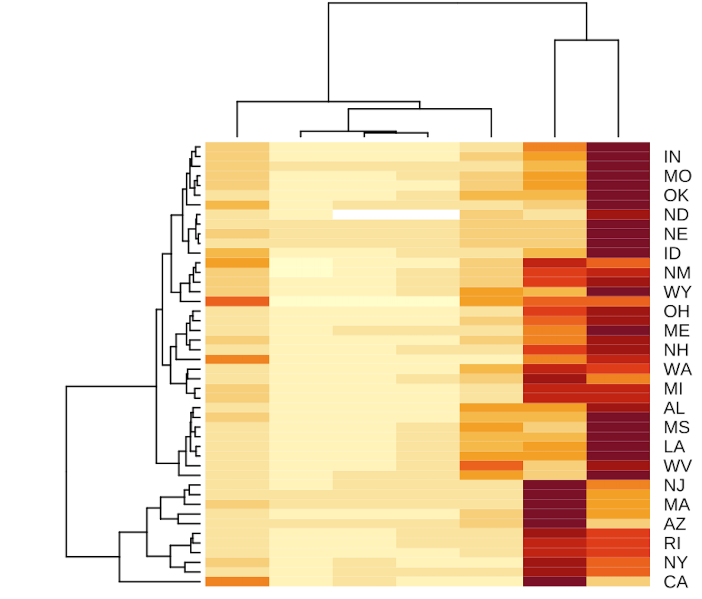

# Cancer and Plants
This project explores the correlation plants and cancer. 

## Files Information
Codes File:

* [`Codes File`](mini_project.Rmd): This file contains the all coding processed.  

Data Files:

* [`Cancer`](mini_project.Rmd): This file contains the data of US cancer.
* [`Power Plants`](US_Dataset_PowerPlants_Locations_Nature_County.csv): This file contains the data of US power plants.
* [`Hazardous Waste Sites`](mini_project.Rmd): This file contains the data of Hazardous Waste Sites in US.

## Introduction  

 

**Cancer**  is a disease caused when cells divide uncontrollably and spread into surrounding tissues. As a disease with a high mortality rate and low rehabilitation rate, cancer is the most leading cause of death, excluding heart disease and cancer rate becomes a vital indicator to measure public health.  According to the [report](https://www.who.int/zh/news-room/fact-sheets/detail/cancer) of WHO: Lung cancer is the most common cancer(shown in left image). Besides, personal behavior factors, (such assmoking, drinking, unhealthy diet and lack of exercise), physical, chemical and biological carcinogens( air pollution and exposure to asbestos) are also dangerous lung cancer-causing agents. As we know, the industrial sites are the main source of air pollution. Thus this project will explore the correlation factories and cancer, figuring out whether industrial sites should be responsible for cancer rate.

## Cancer Distribution 

The visualization above shows the cancer rate information per county, this project explores cancer from 4 aspects: (If you are in need of the larger images, please click  on the names of the images. )

* The top-left plot is  [` Age-Adjusted Cancer Case per 100,000 per County`](images/Case_age.png). It shows the cancer rates per county. Because cancer outcomes occur at different rates in different age groups. In order to remove confounding caused by age, the project considers Age adjustment here. 
* The top-right plot is  [`Average Annual Case per County`](images/avg_case.png) It shows the average number of cancer cases per county.
* The bottom-left plot is [`Cancer Case Incidence Rates per County`](images/Incidence_Rates.png) It shows the incidence rate trend, which is the trend of the rate of occurrence per year of new cases, per county.
* The bottom-right plot is [`Cancer Case Trend per County`](images/trend.png).  It shows the trends of case.

Apparently, the cancer rate varies greatly in different regions. Overall, the closer to the **East** counties, the worse the cancer status (darker color of both cancer rate and the number of cancer cases). Nex Mexico holds a relatively lower cancer rate and a clear declining trend, which is the best state in the United States. Even though, the **Midwest region** has a low number of people who has cancer, it shows high cancer rate after age adjustment and increasing incidence rate,  the situation of the Midwest region is not optimistic. As for the **West region**, especially California, it looks like many people have cancer,  but the good news is it is getting better. This region has a lower cancer rate after removing the age impacts and has a significant downward trend, the North East region as well.

## Plants Distribution

The visualization above shows the plants distribution in US, comparing the distribution plants with cancer status.  (If you are in need of the larger images, please click  on the names of the images. )  
* The **right column** plots show the comparison between sites and age-adjusted cancer rate  
* The **left column** plots show the comparison between sites and the number of people who get cancer.   
* The **first-row** plots: [`Hazardous Waste Sites by cancer rates`](images/Case_age.png) and   
[`Hazardous Waste Sites by cancer counts`](images/avg_case.png) show the comparison between cancer and Hazardous Waste Sites listed on the National Priorities List The site scores calculated by the Hazard Ranking System and measure the environment pollutant risk. The higher score, higher risks.   
* The **second-row** plots: [`Primary Fuel type of Power Plants by cancer rates`](images/Fuel_Type_rate.png) and [`Primary Fuel type of Power Plants by cancer counts`](images/Fuel_Type_count.png) show the comparison between cancer and power plants in US, the sites are coloured by primary fuel of sites.   
* The **third-row** plots: [`Capacity Level of Power Plants by cancer rates`](images/cap_rate.png) and [`Capacity Level of Power Plants by cancer counts`](images/cap_count.png) show the comparison between cancer and power plants in US, the sites are coloured by the capacity level of sites  

Similar to the high cancer rate distribution, there are more **Hazardous Waste Sites** or **power plants** in the East region. The sites with higher site score(dark green points in the top left plot) are located in the counties that have worse cancer status.  This pattern is even clearer on the left plots: comparison between sites and number cancer cases. Two distributions almost have the same geographical pattern, indicating that the areas have Hazardous waste sites or power plants, people are more likely to get cancer. The denser the sites, the higher number of cancer cases. And the light regions (low number of cancer cases) barely has power plants or Hazardous waste sites.

Additionally, it is also apparent that there is also some correlation between **primary fuel type** and capacity with the number of cancer cases. The power plants use more gas, oil, waste and hydro as fuel tend to have more number of cancer cases. Surprisingly, plants that use solar energy as their main fuel are also concentrated in high cancer case regions, but these region also are area the has clear decrease trends. The wind power plants seem to has less impact on health. 

As for the **capacity level**, high capacity level plants are concentrated in the East region. Although low capacity level plants are concentrated in some high cancer rates regions and high cancer cases regions, the density of factories in these areas is also very large. So we do not have enough evidence shows that capacity level has a significant impact on cancer, density of power plants may dominate the result. This project will explore the correlation between capacity and cancer in the statistical section.  

## State Distribution

The image above shows the cancer distribution and plant distribution pre state. The details have been discussed in the previous two sections, and this project will not repeat here.

## Statistical Analysis

#### Correlation between fuel type and cancer

In order to test the correlation between fuel type and cancer cases or cancer rates, the project implements the Anova method. The image above shows the results. Both p-values are significantly less than 0.05, thus the null hypothesis, that the primary fuel type is independent of cancer rates or cancer cases, can be rejected. Thus we have enough evidence to conclude that primary fuel type is correlated with cancer cases or cancer rates. 
 
#### Correlation between sites density and cancer

The image above is the results of the Pearson method which test the correlation between the number of hazardous waste sites or power plants and cancer. By the p-value, we have enough evidence to conclude that there is a correlation between plants density and the number of cancer cases; there is  no correlation between plants density and age-adjusted cancer rat. Older people are more vulnerable to factory pollution. The industrial sites have greater impacts on the elderly. 

#### Correlation between sites pollution  risk and cancer

The image above is the results of the Pearson method which test the correlation between the score of hazardous waste sites or capacity Level of power plants and cancer. By the p-value, we have enough evidence to conclude that there is a weak correlation between power plants capacity and the age-adjeusted cancer rates; there is no correlation between pollution risk level of  hazardous waste sites and cancer rates. 

## Conclusion and Discussion

To sum up, cancer is indeed related to industrial sites, the geographical distribution of industrial sites and cancer cases are similar. The denser the factory, the easier to get cancer. The regions where the plants mainly use oil, waste and hydro as fuel are more likely to harm people's health, especially for old people. The old people are vulnerable to pollution, probably children as well. But some green energy (solar energy or wind energy) brings new hope, Where the power plants using green energy, has significant decreasing trends and low incidence rates trend.

In short, we have enough evidence to conclude that the density of the plant and the fuel used is a significant factor that will impact cancer rates. But why? The research from [American Lung Association](https://www.lung.org/blog/reducing-air-pollution) may give us some answers:

> Power plants emit more than 80 hazardous air pollutants required for control under the Clean Air Act, including arsenic, chromium, lead, formaldehyde, acid gases, dioxins, and furans. This particle pollution alone worsens asthma, triggers heart attacks, causes multiple cancer (mainly lung) and shortens lives. 

It seems that reducing the density of plants can reduce the rate of cancer. But can we just simply shut these plants down? Of cause, No! Power plants are the crucial key to maintain our daily life. Measuring society development, both common people's life quality (including the public health issue) and the operating efficiency of light or heavy industries are important indicators. The quality of human life needs to be guaranteed by industrial development, and industrial development harms the environment and causes pollution issue. But these pollutions will eventually be fed back to humans, for example, high cancer risk. Then, in order to cure cancer, humans may need more industrial support (such as Medical Equipment industry). Oops, endless loop! This contradictory seems to be an eternal theme of human development. 
Friedrich Engels use to warn us:

> Let us not, however, flatter ourselves overmuch on account of our human victories over nature. 

For each such victory, nature takes its revenge on us.
What humans suppose to do is find a balance between social development and the environment. For example, looks for green power and renewable energy, at least, by the result of this project, using solar energy does help reduce cancer rates. This is an arduous process, but this is also the responsibility and mission of the human being.

